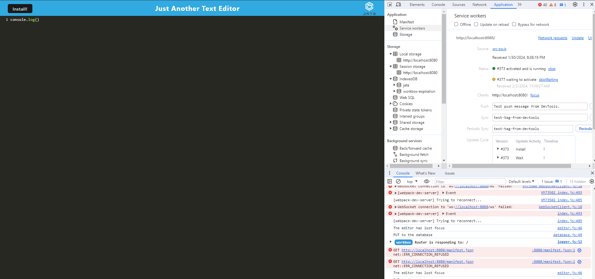

# Progressive-Web-Applications-PWA-Text-Editor

## Description

This Web Text editor application allows user to create notes in the browser with or without internet connection. The application would store data from the Web Text editor of what ever they input in the text box. This allow the user to access the data from the browser without internet connection.

# Table of Contents
-[Installation](#Installation)
-[Usage](#usage)
-[Credits](#credits)

# Installation

To install the dependency

use npm install

# Usage

To run the application 

run Start:dev

than go to the application to start your web text editor

